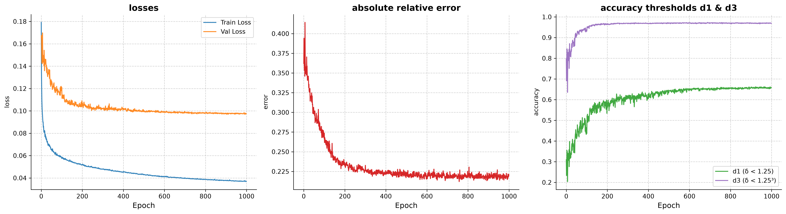

[](https://github.com/dmalynyak/depth-estimator-pytorch/actions/workflows/tests.yaml)


## About
**Project is not finished**
## Demo
### Indoor:
### Outdoor:

## Features

## Components

## Results


### training graphics


## Limitations

## Installation

**Hardware Requirements:**
To run this project efficiently, the following hardware is recommended:
* **CPU:** No specific requirements (any modern x86_64 or ARM processor).
* **CUDA (NVIDIA):** RTX 2060 or newer is recommended for Tensor Core support (autocast and scaler). 
Otherwise, disable mixed precision (autocast / GradScaler) in the training and evaluation loop 
* **MPS (Apple):** Apple Silicon (M1 chip or newer).

```bash
# 1. Clone the repo
git clone https://github.com/dmalynyak/ANPR-plate-recognition
cd ANPR-plate-recognition

# 2. Create a virtual environment
python3 -m venv .venv
source .venv/bin/activate # MacOS and Linux

# 3. Install dependencies
pip install -r requirements.txt
```


### Model weights
Two weights are included:  
 - **Indoor NYU trained:** weights/nyu.pt

Due to file size limits, the trained weights(OCR and YOLOv2) are hosted in GitHub Releases. You need to download both files to run the project.

**Download via terminal:**
```bash
wget wget https://github.com/dmalynyak/depth-estimator-pytorch/releases/download/nyu_1/nyu_weights.pt -O weights/nyu.pt
```

## Datasets
NYU indoor dataset with ~750 train images with ground truth depths.  
```bash
wget http://horatio.cs.nyu.edu/mit/silberman/nyu_depth_v2/nyu_depth_v2_labeled.mat
wget http://horatio.cs.nyu.edu/mit/silberman/indoor_seg_sup/splits.mat
# after downloading you should run script:
python scripts/convert_mat_to_png_npy.py
```


## Usage

train indoor images:
```bash
python -m src.train --device cuda --chkpt_path 'your_path' --log_path 'your_path'
# to see live graphics of training run:
tensorboard --logdir="your_log_path" 
```

inference indoor NYU images:
```bash
python -m nyu_inference --device cuda --file_path 'your_file_path' --model_path weights/nyu.pt 
```