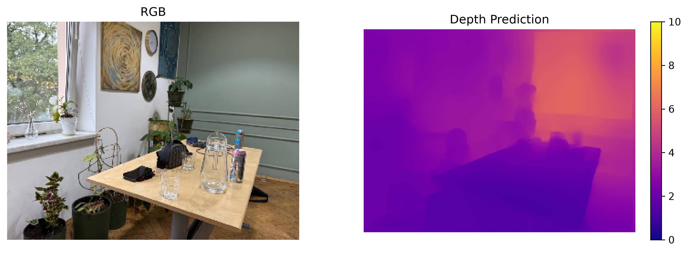
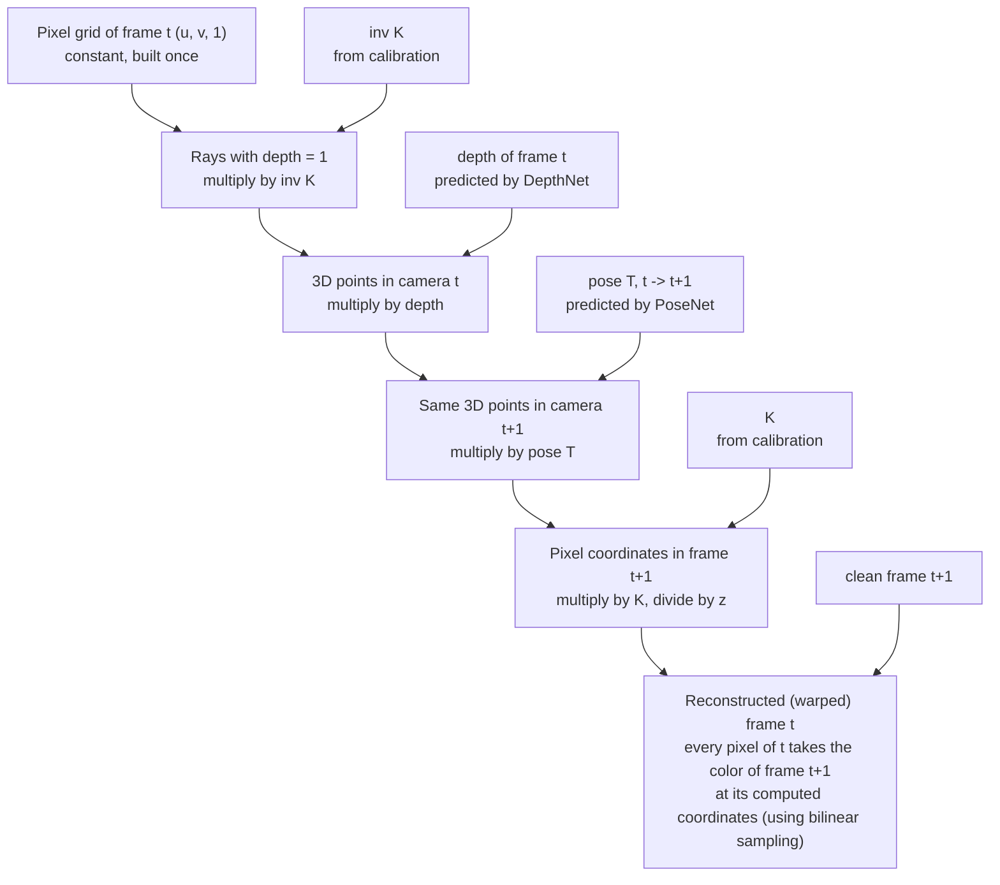
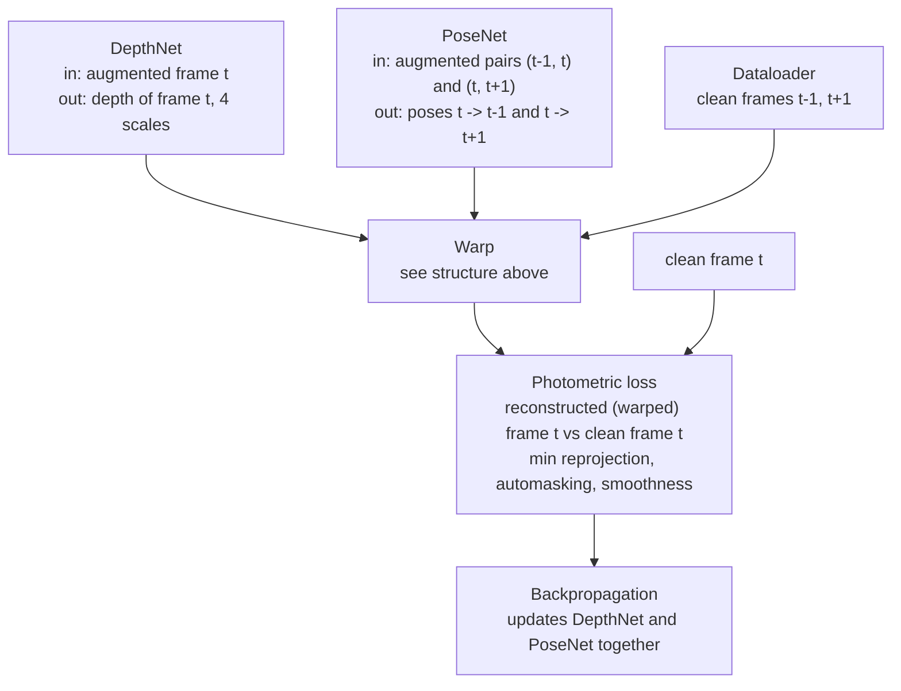
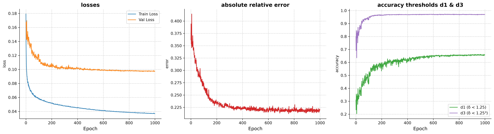
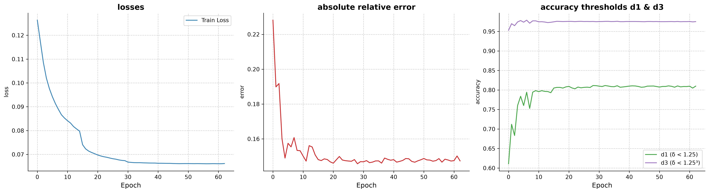

[](https://github.com/dmalynyak/depth-estimator-pytorch/actions/workflows/tests.yaml)

# Depth Estimator. Self-supervised learning.

## About

Monocular depth estimator for indoor and outdoor images and video.  
The goal was to understand how self-supervised training, image warping, photometric loss, etc work.  
Everything is written from scratch in PyTorch, except the pretrained ResNet18 encoder. 

| | Indoor | Outdoor |
|---|---|---|
| **Dataset** | NYU Depth v2 | KITTI raw |
| **Training** | supervised (depth labels) | self-supervised (video frames only) |
| **Networks** | ResNet18 encoder + custom decoder | ResNet18-style decoders + DepthNet, PoseNet custom decoders |  

The outdoor part follows the approach of [Monodepth2](https://github.com/nianticlabs/monodepth2), reimplemented from scratch.


## Demo
### Indoor:


### Outdoor:

## Structure  
### Warping

```mermaid
graph TD
    A["Pixel grid of frame t (u, v, 1)<br/>constant, built once"] --> B["Rays with depth = 1<br/>multiply by inv K"]
    invK["inv K<br/>from calibration"] --> B
    B --> C["3D points in camera t<br/>multiply by depth"]
    depth["depth of frame t<br/>predicted by DepthNet"] --> C
    C --> D["Same 3D points in camera t+1<br/>multiply by pose T"]
    poseT["pose T, t -> t+1<br/>predicted by PoseNet"] --> D
    D --> E["Pixel coordinates in frame t+1<br/>multiply by K, divide by z"]
    K["K<br/>from calibration"] --> E
    E --> F["Reconstructed (warped) frame t<br/>every pixel of t takes the color of frame t+1<br/>at its computed coordinates (using bilinear sampling)"]
    clean["clean frame t+1"] --> F
```
The same is done for frame t-1 with the inverted pose.  
If depth and pose are correct, the reconstructed frame t looks exactly like the real frame t.

### Forward pass

```mermaid
graph TD
    Depth["DepthNet<br/>in: augmented frame t<br/>out: depth of frame t, 4 scales"] --> Warp["Warp<br/>see structure above"]
    Pose["PoseNet<br/>in: augmented pairs (t-1, t) and (t, t+1)<br/>out: poses t -> t-1 and t -> t+1"] --> Warp
    Clean["Dataloader<br/>clean frames t-1, t+1"] --> Warp
    Warp --> Loss["Photometric loss<br/>reconstructed (warped) frame t vs clean frame t<br/>min reprojection, automasking, smoothness"]
    CleanT["clean frame t"] --> Loss
    Loss --> Back["Backpropagation<br/>updates DepthNet and PoseNet together"]
```
Networks see augmented frames, the loss compares clean ones.

## Features
 - **Self-supervision** - outdoor model is trained only on video frames, no depth labels. Depth and motion are learned through image warping (see structure above).
  - **End to end inference** - images and video are processed automatically.
 - **Photometric loss** -  0.85 · SSIM + 0.15 · L1 between the warped and the real frame, computed on 4 decoder scales, plus edge-aware smoothness.
 - **TensorBoard and CSV logging** - live training graphs, metrics after every epoch, the best checkpoint is saved by AbsRel.
 - **Automasking** - pixels that don't change between frames (static camera, objects moving with the car) are ignored.


## Results 
**Both models trained on GTX1660**

**Training** indoor NYU images:
  
**Test metrics:**  
Eigen crop, gt range (0, 10] m, natural log, prediction upsampled, no median scaling (model predicts metric depth).
 
| AbsRel | RMSE | RMSE log | δ < 1.25 | δ < 1.25² | δ < 1.25³ |
|---|---|---|---|---|---|
| 0.212 | 0.777 | 0.271 | 0.651 | 0.901 | 0.973 |

Trained on **~750 images**. 

**Training** outdoor KITTI images:


640x192 input, batch size 4, Adam lr 1e-4, lr divided by 10 every 15 epochs.  

 
**test metrics:**  
Eigen test drives, Garg crop, gt range (0.001, 80] m, median scaling.
 
| | AbsRel | RMSE | RMSE log | δ < 1.25 | δ < 1.25² | δ < 1.25³ |
|---|---|---|---|---|---|---|
| This project | 0.151 | 6.270 | 0.233 | 0.802 | 0.937 | 0.973 |
| Monodepth2 baseline| 0.115 | 4.863 | 0.193 | 0.877 | 0.959 | 0.981 |
 
Monodepth2 is trained on the full Eigen-Zhou split of KITTI dataset (**~40,000 frames**, static frames removed).
This project is trained on a subset of KITTI Eigen-Zhou split (**~7,500 frames**, static are not removed)
 

## Limitations
 - **Unknown scale** - a single camera can't tell a small close scene from a big far one, so outdoor model predicts depth only up to a scale factor. Metrics and inference use median scaling.
 - **Moving objects** - cars that move with the same speed as the camera look static so PoseNet tends to predict infinite distance. This problem is being partly solved by identity mask in training loop. 
 - **Training data** - only part of KITTI raw is used (due to size limitations), static frames are not removed. Thus results are little bit worse then Monodepth2 project.
 - **Indoor dataset size** - NYU part is trained on ~750 images only. This part of the project was a simple training before self-supervised outdoor part, thats why results are so bad.
 - **Small batch size** - KITTI part is trained using batch size = 4, due to the lack of VRAM.


## Installation

**Hardware Requirements:**
To run this project efficiently, the following hardware is recommended:
* **CPU:** No specific requirements (any modern x86_64 or ARM processor).
* **CUDA (NVIDIA):** RTX 2060 or newer is recommended for Tensor Core support (autocast and scaler). 

* **MPS (Apple):** Apple Silicon (M1 chip or newer).

```bash
# 1. Clone the repo
git clone https://github.com/dmalynyak/depth-estimator-pytorch
cd depth-estimator-pytorch

# 2. Create a virtual environment
python3 -m venv .venv
source .venv/bin/activate # MacOS and Linux

# 3. Install dependencies
pip install -r requirements.txt
```


### Model weights
Two weights are included:  
 - **Indoor NYU:** weights/nyu.pt
 - **Outdoor KITTI:** weights/kitti.pt

Due to the GitHub file size limit, the trained weights are hosted in GitHub Releases. You need to download both files to run the project.

**Download via terminal:**
```bash
# indoor model weights:
wget https://github.com/dmalynyak/depth-estimator-pytorch/releases/download/nyu_1/nyu_weights.pt -O weights/nyu.pt
# outdoor model weights:
wget https://github.com/dmalynyak/depth-estimator-pytorch/releases/download/kitti_weights/kitti.pt -O weights/kitti.pt
```

## Datasets
**NYU** indoor dataset with ~750 train images with ground truth depths.  
```bash
wget http://horatio.cs.nyu.edu/mit/silberman/nyu_depth_v2/nyu_depth_v2_labeled.mat
wget http://horatio.cs.nyu.edu/mit/silberman/indoor_seg_sup/splits.mat
# after downloading you should run script:
python scripts/convert_mat_to_png_npy.py 
```  
**KITTI** raw outdoor dataset. Only `image_02` (one rgb camera) is used for training, `velodyne_points` only for val/test ground truth.  
Every drive is downloaded separately, every date needs its own calibration:
```bash
cd data/kitti
base=https://s3.eu-central-1.amazonaws.com/avg-kitti/raw_data
 
# calibration (once per date)
wget ${base}/2011_09_26_calib.zip && unzip -q 2011_09_26_calib.zip && rm 2011_09_26_calib.zip
mkdir -p 2011_09_26/2011_09_26_calib && mv 2011_09_26/calib_*.txt 2011_09_26/2011_09_26_calib/
 
# one drive (repeat for every drive you need)
name=2011_09_26_drive_0001
wget ${base}/${name}/${name}_sync.zip && unzip -q ${name}_sync.zip && rm ${name}_sync.zip
rm -rf 2011_09_26/${name}_sync/{image_00,image_01,image_03,oxts}
```  
After downloading, generate ground truth depth for val/test drives once:
```bash
python scripts/load_and_parse.py
```

Expected structure:
```
data/kitti/2011_09_26/
├── 2011_09_26_calib/
└── 2011_09_26_drive_0001_sync/
    ├── image_02/
    ├── velodyne_points/   # val/test drives only
    └── gt_depth/          # created by the script above
```
Train/val/test split is made automatically on start of training loop.


## Usage
**Inference:**
```bash
# Indoor: 
python -m indoor_inference --device cuda --file_path 'your_file_path' --model_path weights/nyu.pt
# Outdoor: 
python -m outdoor_inference --device cuda --file_path 'your_file_path' --model_path weights/kitti.pt
```

**Train:**
```bash
# Indoor:
python -m src.indoor_train --device cuda --chkpt_path your_path/best.pt --log_path your_path/metrics.csv
# to see live graphics of training run:
tensorboard --logdir="your_log_path"
# Outdoor:
python -m src.outdoor_train --device cuda --chkpt_path your_path/best.pt --log_path your_path/metrics.csv
```
## Structure
```text

├── assets/ # demoes
├── indoor_inference.py
├── outdoor_inference.py
│
│
├── scripts
│  ├── convert_mat_to_png_npy.py
│  ├── draw_train_metrics.py
│  └── load_and_parse.py
│
│
├── src
│  ├── outdoor_train.py
│  ├── indoor_train.py
│  ├── __init__.py
│  ├── dataloaders
│  │  ├── __init__.py
│  │  ├── create_splits.py
│  │  ├── depth_loader.py
│  │  ├── kitti_depth_loader.py
│  │  └── transformers.py
│  ├── inference_engines
│  │  ├── __init__.py
│  │  ├── indoor_inference_engine.py
│  │  └── outdoor_inference_engine.py
│  ├── losses
│  │  ├── __init__.py
│  │  ├── indoor_losses.py
│  │  └── outdoor_losses.py
│  ├── metrics
│  │  ├── __init__.py
│  │  ├── kitti_outdoor_metrics.py
│  │  └── nyu_metrics.py
│  ├── models
│  │  ├── __init__.py
│  │  ├── kitti_depthnet.py
│  │  ├── kitti_posenet.py
│  │  ├── kittidecoder.py
│  │  ├── nyudecoder.py
│  │  ├── nyumodel.py
│  │  ├── posenetdecoder.py
│  │  ├── posenetencoder.py
│  │  └── resnet18.py
│  ├── train_engines
│  │  ├── __init__.py
│  │  ├── indoor_engine.py
│  │  └── outdoor_engine.py
│  └── utils
│     ├── __init__.py
│     ├── argparse.py
│     ├── geometry.py
│     ├── kitti_final_eval.py
│     ├── kitti_warping.py
│     ├── logger.py
│     └── visualize.py
│
│
├── tests/ # CI tests
├── LICENSE
├── README.md
├── requirements.txt
└── weights # actual weights needs to be downloaded
   ├── kitti_info.txt
   ├── kitti_train_graphics.png
   ├── nyu_info.txt
   └── nyu_train_graphics.png
```